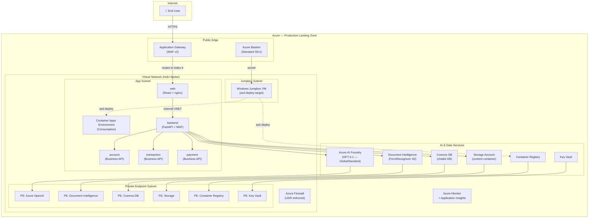

# Production Deployment — Azure AI Foundry Landing Zone

This directory contains the **production-grade infrastructure** for the multi-agent home banking assistant, built on the [Azure AI Foundry Landing Zone](https://github.com/Azure/bicep-ptn-aiml-landing-zone) (`bicep-ptn-aiml-landing-zone`) pattern.

---

## Architecture



---

## Services Deployed

| Service | Description | External? | Port |
|---------|-------------|-----------|------|
| `backend` | FastAPI + Microsoft Agent Framework orchestration | No (internal) | 8080 |
| `account` | Account management business API (MCP tools) | No (internal) | 8080 |
| `transaction` | Transaction history business API (MCP tools) | No (internal) | 8080 |
| `payment` | Payment processing business API (MCP tools) | No (internal) | 8080 |
| `web` | React 18 + shadcn/ui banking web frontend | Yes (via AppGW) | 80 |

---

## Prerequisites

- Azure CLI ≥ 2.65 with `az bicep upgrade` run
- Azure Developer CLI (`azd`) ≥ 1.10
- An Azure subscription with **Owner** role (needed for RBAC assignments)
- Docker Desktop (for local `remoteBuild` support)

---

## First-Time Deployment

### 1. Configure environment variables

```bash
# Required — your outbound IP for Bastion access control
export BASTION_ALLOWED_SOURCE_IP="<your-public-ip>"   # e.g. 203.0.113.42

# Optional overrides (defaults shown)
export AZURE_DOCUMENT_INTELLIGENCE_LOCATION="eastus"
export AZURE_LOCATION="eastus"
```

On Windows (PowerShell):
```powershell
$env:BASTION_ALLOWED_SOURCE_IP = "<your-public-ip>"
$env:AZURE_DOCUMENT_INTELLIGENCE_LOCATION = "eastus"
$env:AZURE_LOCATION = "eastus"
```

> **Tip:** Get your public IP with: `curl -s https://api.ipify.org`

### 2. Log in

```bash
az login
azd auth login
```

### 3. Provision

```bash
cd lza-infra
azd provision
```

`azd provision` will:
1. Provision all Azure resources via `main.bicep` (networking, AI Foundry, Document Intelligence, CosmosDB, Storage, Container Apps, jumpbox, Bastion, Firewall)
2. Run the `postprovision.ps1` hook automatically, which connects to the jumpbox over a Bastion tunnel and runs `azd deploy` inside the private network — building Docker images via ACR remote build and deploying all 5 container apps

> **Note:** There is no need to run `azd deploy` manually on first deployment. The postprovision hook handles it. Use `azd deploy` directly (via jumpbox) only for subsequent app-only updates.

---

## Subsequent Deployments

After the initial deployment, subsequent app-only updates can be done directly from the jumpbox:

```bash
# Connect to jumpbox via Bastion tunnel (from your workstation)
az network bastion tunnel \
  --name <bastion-name> \
  --resource-group <rg-name> \
  --target-resource-id <vm-resource-id> \
  --resource-port 22 \
  --port 2222

# In a separate terminal — deploy via tunnel
cd lza-infra
azd deploy
```

Or use the convenience script:
```powershell
.\hooks\scripts\deploy-via-jumpbox.ps1
```

---

## Cosmos DB Containers

The deployment creates a `chatkit` database with three containers:

| Container | Partition Key | Purpose |
|-----------|---------------|---------|
| `threads` | `/user_id` | ChatKit conversation threads |
| `items` | `/user_id` | ChatKit messages and items |
| `attachments` | `/user_id` | Invoice/receipt file references |

---

## Container App RBAC

| Service | Roles Granted |
|---------|--------------|
| `backend` | Cognitive Services User, Cognitive Services OpenAI User, AcrPull, CosmosDB Built-in Data Contributor, Storage Blob Data Contributor, Key Vault Secrets User |
| `account` | AcrPull |
| `transaction` | AcrPull |
| `payment` | AcrPull |
| `web` | AcrPull |

---

## Key Parameters

| Parameter | Value | Description |
|-----------|-------|-------------|
| `networkIsolation` | `true` | Full private networking via Private Endpoints |
| `deployDocumentIntelligence` | `true` | FormRecognizer S0 for invoice scanning |
| `deployJumpbox` / `deployBastion` | `true` | Secure access to private resources |
| `deployVM` / `deploySoftware` | `true` | Jumpbox VM with azd/Docker pre-installed |
| `publicIngress.backendAppIndex` | `4` | AppGW routes to `web` (index 4 in containerAppsList) |
| `bastionSkuName` | `Standard` | Required for Bastion tunnel support |
| `bastionEnableTunneling` | `true` | Enables SSH/RDP tunnel via Bastion |
| `dbDatabaseName` | `chatkit` | Cosmos DB database name |
| Model | `gpt-4.1` | GlobalStandard, capacity 80, version 2025-04-14 |

---

## Outputs

After `azd provision` completes, the following environment variables are available in the azd environment:

| Output | Description |
|--------|-------------|
| `AI_FOUNDRY_OPENAI_ENDPOINT` | Azure OpenAI endpoint for the backend |
| `DOCUMENT_INTELLIGENCE_NAME` | Document Intelligence resource name |
| `DOCUMENT_INTELLIGENCE_ENDPOINT` | Document Intelligence endpoint URL |
| `STORAGE_ACCOUNT_NAME` | Storage account for file uploads |
| `COSMOS_DB_ENDPOINT` | CosmosDB endpoint |
| `APPLICATIONINSIGHTS_CONNECTION_STRING` | Application Insights telemetry |
| `BACKEND_APP_EXTERNAL_FQDN` | Backend service FQDN (for internal routing) |
| `WEB_APP_INTERNAL_FQDN` | Web frontend FQDN |
| `VM_NAME` | Jumpbox VM name |
| `BASTION_NAME` | Azure Bastion resource name |

---

## Troubleshooting

### AppGW returns 502 on the web frontend
- Verify `publicIngress.backendAppIndex` is `4` (the `web` container app)
- Check the `web` container app health probe responds on port 80

### `azd deploy` fails with registry access denied
- The Container Registry has public access disabled; the jumpbox VM has `AcrPull` + `Contributor` roles and must be used for deploys
- Run `postprovision.ps1` or use `deploy-via-jumpbox.ps1`

### Document Intelligence returns 403
- The `backend` container app has `Cognitive Services User` role — verify it was assigned post-provision
- Check `disableLocalAuth: true` is set and the app uses `DefaultAzureCredential`

### Bastion tunnel connection refused
- Confirm `bastionAllowedSourceIPs` includes your current public IP (check with `curl https://api.ipify.org`)
- Bastion SKU must be `Standard` for tunneling
